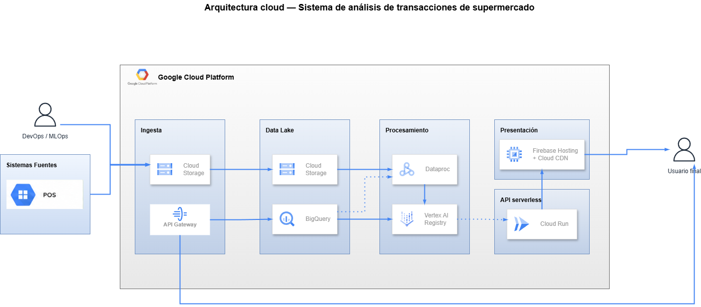
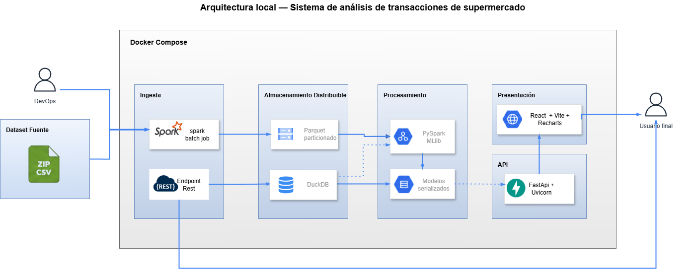

# Documento de Arquitectura

## Introducción

Este documento describe la arquitectura de software y de datos del sistema de análisis de transacciones de supermercado. El propósito del sistema es transformar un volumen considerable de transacciones históricas en información accionable para el negocio, a través de analítica descriptiva, diagnóstica y avanzada, presentada en un tablero interactivo.

Presenta tanto la arquitectura implementada en un entorno local como su proyección a un entorno distribuido en la nube, demostrando que las decisiones de diseño adoptadas habilitan el escalamiento sin reescritura de la lógica de negocio.

---

## Descripción del conjunto de datos

El conjunto de datos proviene de cuatro sucursales de un supermercado y comprende aproximadamente un millón cien mil transacciones registradas durante el primer semestre del año 2013, entre el primero de enero y el treinta de junio.

### Estructura de las transacciones

Cada transacción se representa mediante cuatro campos separados por el carácter de barra vertical. El primer campo es la fecha de la transacción, con granularidad de día y sin componente horario. El segundo campo identifica la sucursal. El tercer campo identifica al cliente. El cuarto campo es la canasta de compra, expresada como una lista de identificadores de categoría separados por espacios.

Un aspecto determinante para el diseño es que la canasta se expresa a nivel de categoría y no a nivel de producto individual. Los identificadores de la canasta corresponden al catálogo de cincuenta categorías y no permiten inferir qué producto específico adquirió el cliente. Esta característica define el nivel de granularidad del análisis transaccional: el sistema razona sobre categorías de compra, mientras que el catálogo de productos se incorpora únicamente como dimensión de enriquecimiento, por ejemplo para describir cuántas referencias contiene cada categoría.

### Implicaciones para el modelado

Dado que no existe un campo explícito de cantidad ni de precio, las nociones cuantitativas del análisis se reinterpretan. El concepto de cantidad se traduce en el número de categorías presentes en una canasta o en el número de apariciones de una categoría a lo largo del tiempo. Esta reinterpretación es coherente con la ausencia de información monetaria señalada entre las restricciones.

Para servir eficientemente a los distintos consumos analíticos, cada transacción se modela en dos representaciones complementarias. La representación de canasta conserva una fila por transacción con la lista completa de categorías, y resulta apropiada para el descubrimiento de reglas de asociación y para las métricas de tamaño de canasta. La representación de línea descompone cada canasta en una fila por cada par de transacción y categoría, y resulta apropiada para el cálculo de indicadores, las agregaciones temporales y los cruces con el catálogo. Ambas representaciones se almacenan de forma particionada para optimizar su consulta posterior.

---

## Visión general de la arquitectura

La arquitectura se organiza en cinco capas con responsabilidades delimitadas, dispuestas según el recorrido natural del dato desde su origen hasta su consumo. El dato ingresa por la capa de ingesta, se persiste en la capa de almacenamiento, se transforma y se modela en la capa de procesamiento, se expone a través de la capa de API, y finalmente se presenta al usuario en la capa de presentación.

Este ordenamiento constituye una decisión de desacoplamiento: cada capa se comunica con las contiguas a través de interfaces estables y desconoce los detalles internos de las demás.

---

## Arquitectura local de referencia

La siguiente figura presenta la arquitectura como se implementa en el entorno local de desarrollo. La totalidad del sistema se ejecuta dentro de un entorno orquestado por Docker Compose, que coordina los servicios y comparte el volumen de datos entre ellos.



*Figura 1. Arquitectura local. El dato fluye de izquierda a derecha, desde el conjunto de datos de origen hasta el usuario final, atravesando las cinco capas dentro del entorno Docker Compose.*

En el extremo izquierdo se ubica el conjunto de datos de origen, representado por el archivo comprimido con las transacciones de las cuatro sucursales. Junto a él, el actor de operaciones es quien dispara los procesos de carga. En el extremo derecho se ubica el usuario final, único consumidor del tablero. Entre ambos extremos, las cinco capas del sistema procesan y transforman la información de forma ordenada.

---

## Descripción detallada de las capas

### Capa de ingesta

La capa de ingesta es la puerta de entrada de la información al sistema y opera por dos vías diferenciadas. La primera vía es un proceso por lotes construido sobre PySpark que realiza la carga inicial masiva del conjunto de datos histórico. Este proceso lee los archivos de origen, los limpia, construye las dos representaciones de la transacción descritas anteriormente y las persiste en la capa de almacenamiento. La segunda vía es un servicio REST que recibe transacciones nuevas de forma incremental.

La existencia de dos vías de ingesta responde a dos escenarios operativos distintos. La carga masiva atiende la inicialización del sistema y las recargas completas, mientras que el servicio REST atiende la operación continua, en la que las transacciones llegan de forma paulatina. Ambas vías convergen en el mismo formato de almacenamiento, lo que garantiza la consistencia de los datos con independencia de su vía de entrada.

### Capa de almacenamiento

La capa de almacenamiento conserva los datos en formato Parquet, un formato columnar comprimido optimizado para cargas analíticas. Las transacciones se almacenan particionadas por sucursal y por mes, lo que permite que las consultas filtradas lean únicamente las particiones relevantes en lugar de recorrer la totalidad del conjunto. Junto a las transacciones, esta capa gestiona también los modelos entrenados, que se serializan y persisten para su posterior consumo por la API.

Sobre estos archivos opera DuckDB, un motor analítico que ejecuta consultas en lenguaje SQL directamente sobre los archivos Parquet, sin requerir un servidor de base de datos independiente. Usar Parquet particionado junto con DuckDB permite hacer consultas analíticas rápidas y eficientes sin necesitar una infraestructura compleja, lo que lo hace ideal para trabajar en un entorno local.


### Capa de procesamiento

La capa de procesamiento ejecuta el análisis avanzado del sistema mediante la biblioteca de aprendizaje automático de Spark. Dos procesos por lotes concentran esta responsabilidad. El primero entrena un modelo de segmentación de clientes mediante el algoritmo K-Means, que agrupa a los clientes según un conjunto de características derivadas de su comportamiento de compra, tales como la frecuencia, el tamaño promedio de canasta, la diversidad de categorías y la recencia. El segundo descubre reglas de asociación mediante el algoritmo FP-Growth, que identifica qué categorías tienden a aparecer conjuntamente en las canastas y constituye la base del motor de recomendaciones.

Los dos procesos toman las transacciones desde la capa de almacenamiento y guardan nuevamente allí los resultados, los modelos entrenados y las reglas encontradas. Esta separación entre el entrenamiento y el uso de los modelos se hace para evitar recalcular todo cada vez que un usuario haga una consulta, ya que los modelos se entrenan una sola vez y luego pueden reutilizarse muchas veces.

### Capa de API

La capa de API expone toda la funcionalidad analítica del sistema a través de un servicio construido con FastAPI y servido por Uvicorn. Esta capa es la única frontera entre la lógica interna del sistema y sus consumidores externos. Organiza sus servicios por dominio funcional, ofreciendo familias de endpoints para el resumen ejecutivo, las visualizaciones analíticas, la segmentación, las recomendaciones y la ingesta de transacciones nuevas.

La capa de API consume dos fuentes internas. Para los indicadores y las visualizaciones, formula consultas SQL a través de DuckDB sobre los datos almacenados. Para la segmentación y las recomendaciones, carga en memoria los modelos previamente entrenados y los sirve directamente. De este modo, la API combina el cálculo en tiempo de consulta con la entrega de resultados precalculados, según convenga al tipo de información solicitada.

### Capa de presentación

La capa de presentación es el tablero interactivo que consume el usuario final, construido con React y la herramienta de desarrollo Vite, con las gráficas elaboradas mediante la biblioteca Recharts. El tablero organiza la información en páginas que corresponden a los grandes módulos del sistema y obtiene todos sus datos exclusivamente a través de la capa de API.

---

## Justificación tecnológica por capa

La elección de cada tecnología responde al criterio  de que el diseño esté preparado para la distribución. La siguiente tabla sintetiza las decisiones adoptadas y su fundamento.

| Capa | Tecnología | Justificación |
|------|-----------|---------------|
| Ingesta por lotes | PySpark 3.5 | Procesa el orden de millón de filas de forma distribuible. El mismo código escala a un clúster sin reescritura de la lógica. |
| Almacenamiento | Parquet particionado y DuckDB | Parquet es columnar, comprimido y compatible con sistemas de archivos distribuidos. DuckDB ejecuta SQL analítico sobre él sin servidor adicional. |
| Procesamiento y aprendizaje | Spark MLlib (K-Means y FP-Growth) | Algoritmos nativos de Spark que se ejecutan en el mismo contexto distribuido, sin necesidad de trasladar los datos completos al nodo conductor. |
| API | FastAPI, Pydantic y Uvicorn | Alto rendimiento asíncrono, tipado estricto, documentación OpenAPI generada automáticamente y gestión ordenada del ciclo de vida de los recursos. |
| Presentación | React, Vite y Recharts | Ecosistema estándar y maduro; Recharts es componible y ligero; Vite ofrece desarrollo ágil y compilación optimizada. |
| Orquestación | Docker Compose | Entorno reproducible en local; la misma definición de contenedores se traslada a servicios gestionados en la nube con ajustes mínimos. |

La idea principal de la tabla es que las tecnologías escogidas no limitan el sistema a un entorno local, ya que cada una tiene una alternativa equivalente en ambientes distribuidos, facilitando una futura migración a la nube.

---

## Arquitectura preparada para distribución de datos

Esta sección explica la característica principal del diseño: estar preparado para manejar datos de forma distribuida. Esta preparación se refleja en tres aspectos diferentes que se complementan entre sí.


### Almacenamiento distribuible sin reescritura

El almacenamiento en formato Parquet es independiente del sistema de archivos que lo aloja. En el entorno local, los archivos residen en el disco bajo el directorio de datos procesados. En un entorno distribuido, esos mismos archivos pueden residir en un sistema de almacenamiento de objetos en la nube o en un sistema de archivos distribuido, sin que su formato ni su organización cambien.

El tránsito de un entorno al otro se reduce a una modificación de configuración, concretamente del prefijo de ruta que indica dónde residen los datos. Tanto los procesos de Spark como las consultas de DuckDB operan sobre rutas expresadas como texto, de modo que reemplazar el prefijo local por el prefijo del almacenamiento en la nube es suficiente para redirigir todo el sistema. La lógica de lectura y escritura permanece intacta.

### Cómputo distribuible sin reescritura

Los procesos en Spark se desarrollan utilizando la interfaz de alto nivel de la librería, que trabaja con estructuras de datos distribuidas y algoritmos propios de aprendizaje automático. Gracias a esto, el mismo código puede ejecutarse tanto en modo local como en un clúster, dependiendo de cómo se configure la sesión de Spark.

El cambio entre ejecución local y distribuida se hace modificando el parámetro que define dónde se coordina el procesamiento. En local, la coordinación se realiza desde la misma máquina; en un entorno distribuido, pasa a un gestor de clúster. Además, durante el entrenamiento no se mueve todo el conjunto de datos al nodo principal, lo que permite mantener la escalabilidad del sistema cuando aumenta el volumen de información.

### Particionamiento eficiente

Las dos representaciones de las transacciones se organizan por sucursal y por mes. Esto permite que, cuando se hace una consulta filtrando por una sucursal o un periodo específico, solo se lean los datos necesarios y no todo el conjunto completo. Como resultado, se reduce el trabajo de lectura tanto en almacenamiento local como distribuido, donde además ayuda a disminuir el tráfico en la red. Por eso, el particionamiento no solo mejora el rendimiento en local, sino que también facilita la eficiencia cuando el sistema crece.


---

## Proyección a la nube

La siguiente figura presenta la proyección del sistema a un entorno distribuido en la nube. La observación fundamental es que la estructura de cinco capas se conserva intacta: las capas mantienen su orden, sus responsabilidades y su flujo. Lo único que cambia es que cada componente local se sustituye por su servicio gestionado equivalente.



*Figura 2. Arquitectura proyectada a la nube. La estructura de capas es idéntica a la de la Figura 1; cada componente local se reemplaza por un servicio gestionado equivalente, sin alterar la lógica del sistema.*

El concepto que articula esta proyección es el de servicio gestionado. Un servicio gestionado es aquel cuyo mantenimiento, disponibilidad y escalamiento son responsabilidad del proveedor de la nube y no del equipo de desarrollo. Al apoyarse en servicios gestionados, el sistema reduce la carga operativa sin alterar su lógica interna.

### Correspondencia entre componentes

La siguiente tabla establece la correspondencia exacta entre cada componente del entorno local y su equivalente en la nube, e indica qué tan profundo es el cambio que implica la migración.

| Capa | Entorno local | Entorno en la nube | Cambio en la lógica |
|------|---------------|--------------------|--------------------|
| Ingesta | Servicio REST de transacciones | API Gateway | Ninguno; misma noción de puerta de entrada por servicio |
| Almacenamiento | Parquet en disco | Almacenamiento de objetos en la nube | Ninguno; idéntico formato y particionamiento |
| Consulta | DuckDB | Servicio de consultas SQL gestionado | Mínimo; ambos interpretan el mismo lenguaje SQL |
| Procesamiento | PySpark en modo local | Servicio gestionado de Spark | Ninguno; mismos procesos, solo cambia el coordinador |
| Modelos | Carpeta de modelos en disco | Registro de modelos gestionado | Ninguno; mismos modelos, con versionamiento adicional |
| API | Contenedor en Docker local | Servicio de contenedores sin servidor | Ninguno; el mismo contenedor se despliega sin cambios |
| Presentación | Servidor local de desarrollo | Alojamiento web con red de distribución | Ninguno; la misma compilación se distribuye globalmente |

La columna relacionada con los cambios en la lógica es una de las más importantes del documento. En la mayoría de las capas, la migración no requiere modificar el código y, en las demás, solo es necesario ajustar configuraciones. Esto demuestra que el sistema fue pensado para trabajar de forma distribuida.

---

## Flujo de ingesta de datos nuevos y recálculo

Más allá de la carga inicial del histórico, el sistema contempla la incorporación continua de transacciones nuevas y la actualización de los modelos analíticos. Esta sección describe ese flujo operativo.

### Incorporación de transacciones

Un sistema externo o un cliente autorizado envía una o varias transacciones nuevas al servicio REST de la capa de API. La API valida la estructura y los tipos de cada transacción y, antes de persistirla, aplica un mecanismo de deduplicación. A cada transacción se le asigna un identificador derivado de la combinación de su fecha, su sucursal y su cliente. Si una transacción ya existente vuelve a enviarse, su identificador coincide con el de la transacción previa y el sistema evita la duplicación. Las transacciones válidas se escriben en el almacenamiento Parquet, respetando el particionamiento por sucursal y por mes. El servicio confirma al solicitante el número de transacciones efectivamente incorporadas.

### Garantía de idempotencia

La idempotencia significa que ejecutar varias veces el mismo proceso de ingesta genera el mismo resultado que ejecutarlo una sola vez. El sistema logra esto utilizando un identificador único para cada transacción junto con una política que evita duplicados o reemplaza registros existentes. Esto es importante para la estabilidad del sistema, ya que permite repetir cargas después de un error sin afectar la integridad de los datos.


### Recálculo de los modelos

La llegada de nuevas transacciones no actualiza automáticamente los modelos analíticos, ya que entrenarlos constantemente consumiría muchos recursos. Por eso, el sistema cuenta con un servicio específico que, cuando se ejecuta, inicia los procesos de Spark para volver a entrenar la segmentación y recalcular las reglas de asociación usando todos los datos disponibles. Después del reentrenamiento, los nuevos modelos se guardan y la API recarga la información en memoria para que las siguientes consultas utilicen los datos actualizados. Con este enfoque se logra un equilibrio entre mantener los modelos actualizados y optimizar el uso de recursos de cómputo.


---

## Estructura del proyecto

La organización de carpetas del proyecto refleja directamente la separación por capas de la arquitectura, lo que facilita la navegación del código y refuerza el desacoplamiento.

```
Proyecto/
├── backend/                  # Capa de API: FastAPI y DuckDB
│   ├── app/
│   │   ├── api/v1/            # Enrutadores organizados por dominio funcional
│   │   ├── core/             # Configuración y registro de eventos
│   │   ├── domain/           # Entidades de negocio sin dependencia del marco
│   │   ├── repositories/     # Acceso a datos mediante consultas DuckDB
│   │   ├── schemas/          # Modelos de respuesta tipados con Pydantic
│   │   └── services/         # Lógica de negocio
│   └── tests/                # Pruebas automatizadas
├── spark_jobs/               # Capa de procesamiento: procesos Spark por lotes
│   └── shared/               # Esquemas y constantes compartidas
├── frontend/                 # Capa de presentación: React, Vite y TypeScript
│   └── src/
│       ├── components/       # Componentes reutilizables
│       ├── pages/            # Páginas del tablero
│       ├── services/         # Cliente de API centralizado
│       └── types/            # Definiciones de tipos
├── data/
│   ├── DataSet/              # Conjunto de datos de origen
│   ├── processed/            # Parquet particionado generado por Spark
│   └── models/               # Modelos de aprendizaje serializados
├── docs/
│   ├── arquitectura.md       # El presente documento
│   └── informe-tecnico.md    # Informe técnico complementario
└── docker-compose.yml        # Definición de la orquestación local
```

